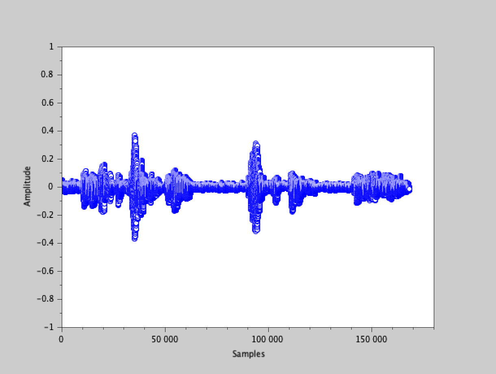

# Digital Signal Processing Assignment 2 Report

Innopolis University, 2020
Digital Signal Processing
Assignment 2

Gleb Petrakov (g.petrakov@innopolis.ru)
B17-SE-01

## Introduction

The problem of the assignment is to process generated sound wave to make it playable and to reduce background noise of that sound.

## Implementation

Required tool to use is SciLab kit.

The data is being generated with `ADC.sce` and data kit in `data` folder. There is total of 14 samples.

The data generation and processing goes in `ProcessRecord(n, quant_step, discretization, sin_freq)` where `n` is number of record, `quant_step` is number of quantization steps (amplitude steps), `discretization` is number of samples per second, `sin_freq` is noise frequency to reduce.

Firstly, I create a record sample with `ADC` and normalize its volume (signal amplitude). 

Then I generate sinusoida to reduce noise. I use record length (number of samples) for sinusoida. The amplitude is 0.1 constantly, since it provides good results.

I apply both the normalization and noise reduction.

Number of quantization steps for sound production is measured in bits (basically, number of steps is `2^n`), with industry standard for mp3 format of 16 bits. I use 8 bit quantization for it is faster to produce and its increasing does not provide better quality.

Discretization industry standard for mp3 is usually 48000 samples. I use 24000 for faster processing.

Sinusoidal frequensies is stored in `sin_freqs` for each samples and was manually brute-forced by me.

In a loop for every of 14 samples, I process it and concatenate them in `record`.

I produce sound plot and save it in `plot.png` as image.

I save resulting wave in `record.wav`.

## Results

The resulting code for SciLab is available in `process.sce`.

Running the code producing `plot.png` with sound wave and `record.wav` with full record.

This report available as `report.md` in markdown and as `report.pdf` as PDF.

The record is **“Alone” by Edgar Allan Poe**.

### Plot

