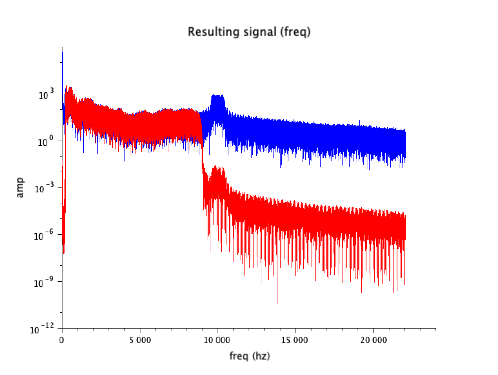
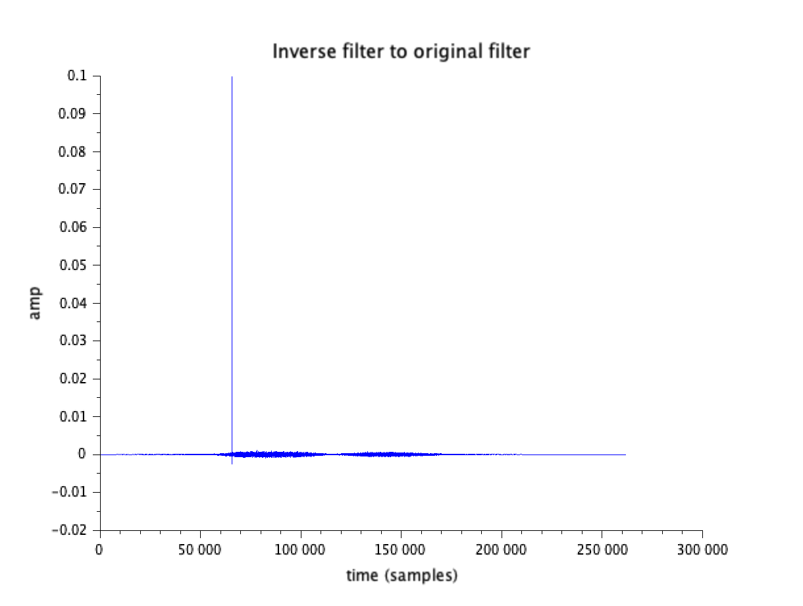

# Digital Signal Processing Assignment 4 Report

Innopolis University, 2020
Digital Signal Processing
Assignment 4

Gleb Petrakov (g.petrakov@innopolis.ru)
B17-SE-01

## Introduction

Task 1: to get rid of high-frequency and low-frequency noise from the track by using highpass and lowpass filters.

Task 2: design an inverse filter, that cancels out the original filter.

## Task 1

### Implementation

All corresponding files can be found in `task1/` folder with `task1.sce` being the source code for SciLab.
`signal_with_noise_and_filtered.sod` is a source signal file needed to be processed.

`create_lowpass_filter`and `create_highpass_filter` create filter signals with specified length, cutoff and threshold.

`create_filter` creates final filter to convolve some signal with, creating frequency response from original filter, creating impulse response, shifting filter and applying window function to it.

Program creates highpass and lowpass filters, convolves them with original signal and building resulting graphs (frequency and amplitude).

### Results

The result of a program is a file `result.wav` with filtered noise and two graphs for freqency response and track amplitude, where in blue is the original track and in red is filtered track.

As you can see on graphs below (from results), program successfully filtered low frequencies for under 20 Hz and high frequencies for over 9 kHz. The resulting track has much more clear sound.

## task 2

### Implementation

All corresponding files can be found in `task2/` folder with `task2.sce` being the source code for SciLab.
`1a_marble_hall.wav` is a source signal file needed to be processed, `7cef8230.wav` is a given IR sample and `irc_kalich.wav` is IR from previous assignment.

`create_filter` is the same as for previous task.

`invert_filter` is function to invert filter.

Program loads all the resources, creates filters from IRs, applies them to original track.

Program plots the result of convolution with original filter as `result.png` and saves processed original track as `result.wav`.

### Results

The applied filter from previous assignment makes the track unintelligible.

The application of inverse filter to original indeed leads almost to Kronecker sequence (as shown below).

