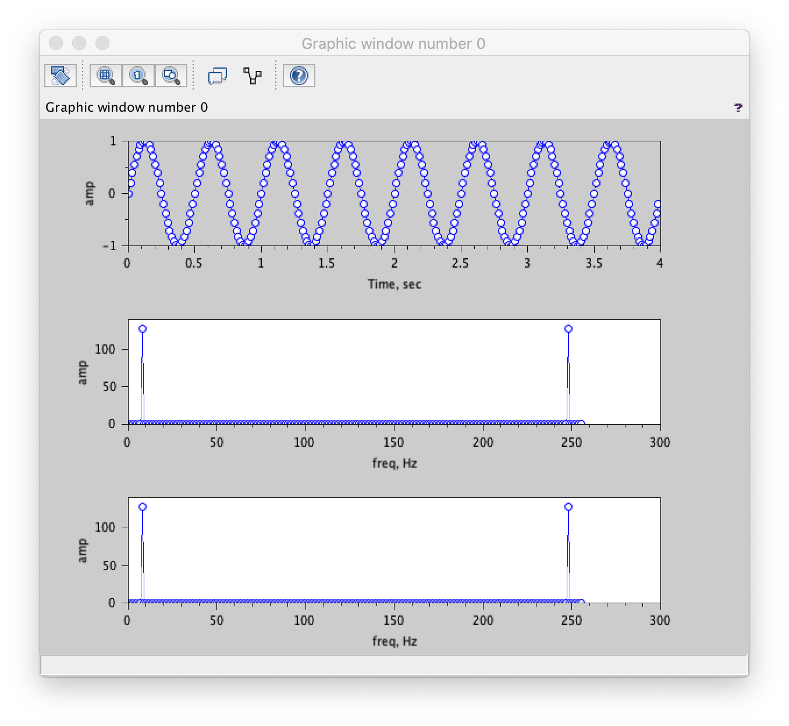
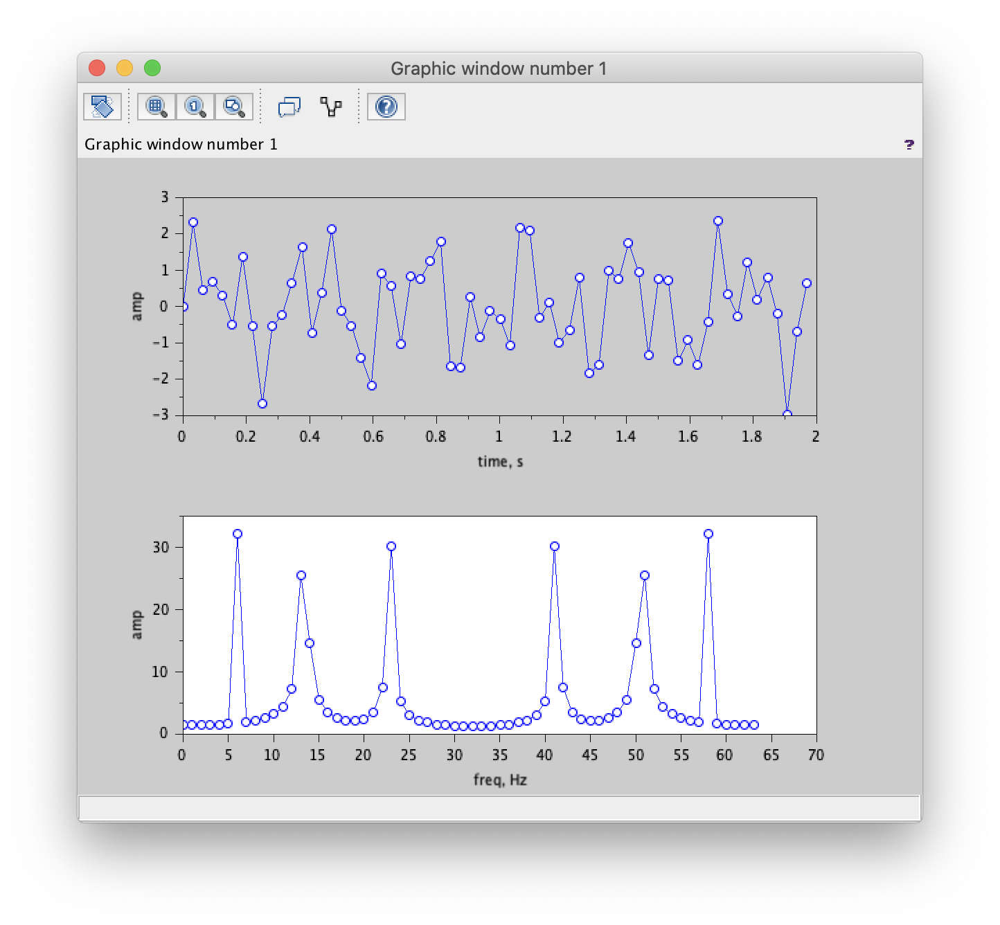
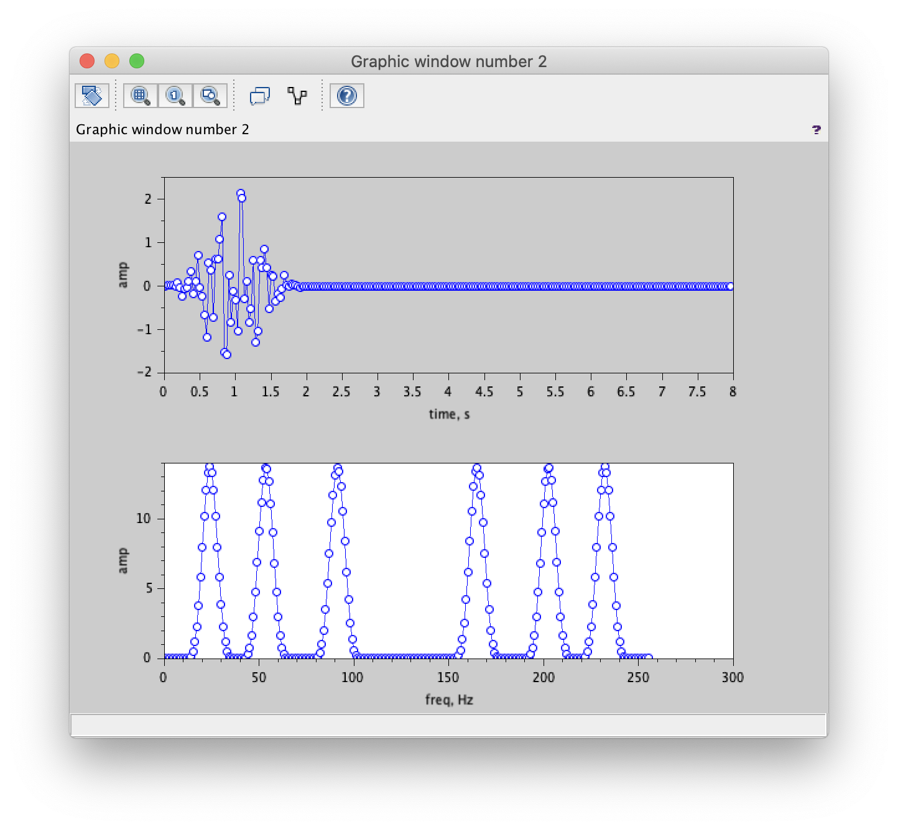
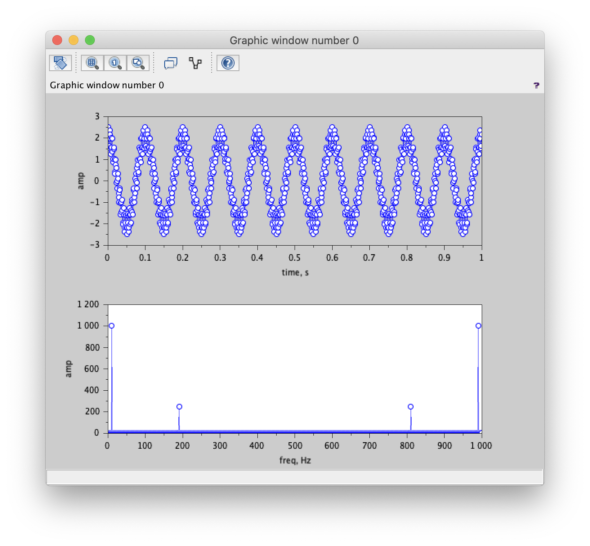

# Digital Signal Processing Assignment 5 Report

Innopolis University, 2020

Digital Signal Processing

Assignment 4

Gleb Petrakov (g.petrakov@innopolis.ru)

B17-SE-01

## Task 1

In this task I implemented custom Discrete Fourier Transform algorithm using pseudocode from assignment description.

On the image below, you can see the original sine signal with 64 discretization rate, 4 seconds length, frequency of 8 and amplitude 1.

The second subplot shows frequency responce of custom written DFT algorithm. The third subplot shows frequency response by built-in SciLab fft() function (dft function is deprecated, but fft is just a faster form of dft, so it should give same results).

## Task 2

In this task I generated signals with leakage and without it (with respect to DFT) with the same amplitude and frequencies of 13.37, 22.8 (both leak) and 6 (does not leak). Produced signal of sum of all three sine signals then goes to DFT.

Three corresponding (with human approximation) peaks shows corresponding amplitudes of original signals on frequency response plot. Two of them are leaked (small slopes for other frequencies).

## Task 3

In this task I tried to get rid of leakage by applying spectral interpolation. It is done by windowing original signal (window size is the same as signal, other is zeros). The resulting plot shows three distinctive peaks of correct frequencies with "a little of leakage".

## Task 4

In this task I tried to adjust sample rate in a way DFT would produce correct frequencies on frequency response diagram. For signal of 1 second long I must utilize Nyquist Theorem, making discretization rate at least twice bigger than biggest signal frequency, which is 190Hz, making discretization rate of 1000 works well.

