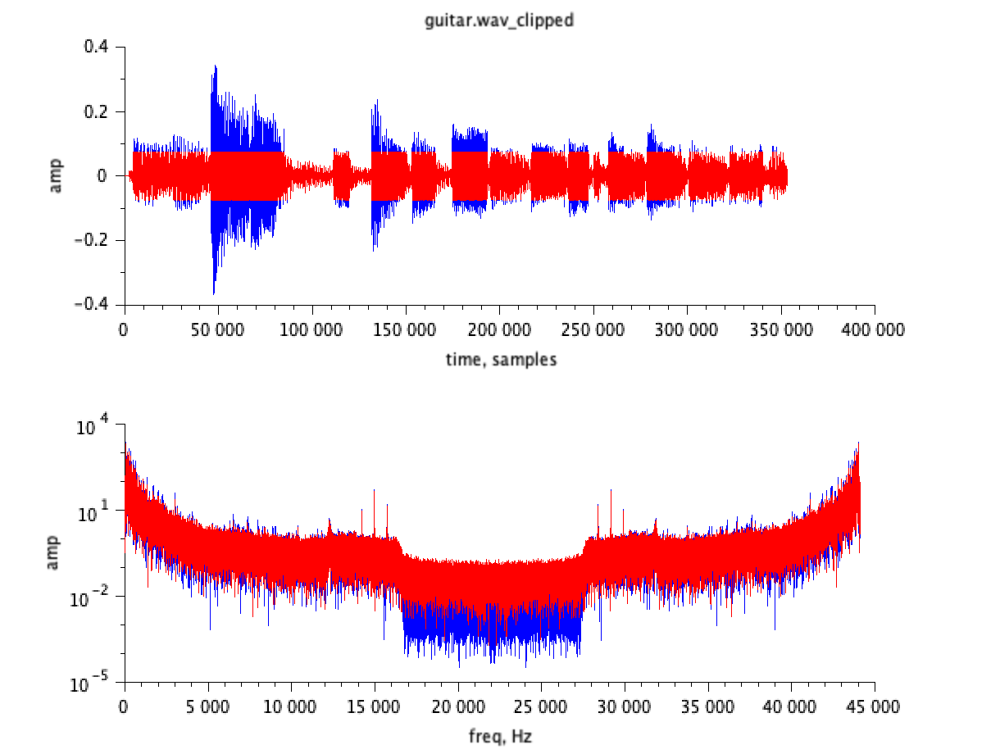
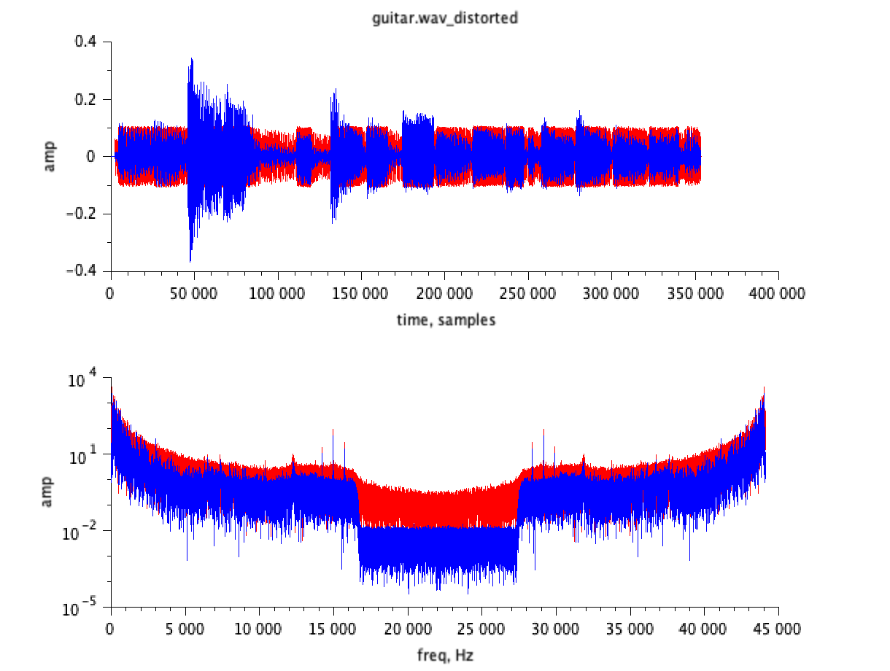
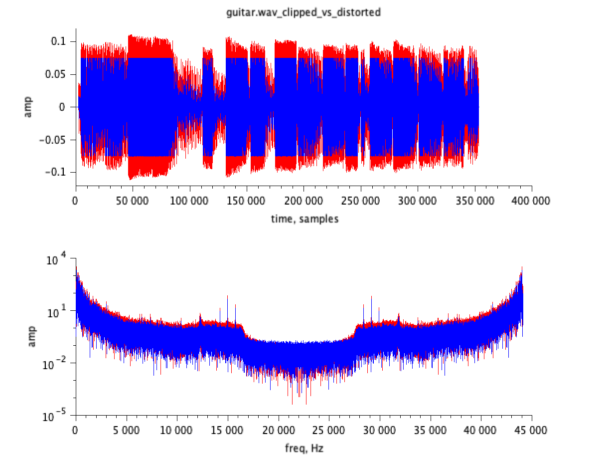

# Digital Signal Processing Assignment 6: Non-Linear Transformations

Gleb Petrakov
g.petrakov@innopolis.ru
B17-SE-01

Innopolis University, 2020
Digital Signal Processing

## Introduction

The goal of this assignment was to learn about non-linear transfornations of signal, how they can be implemented, how they can be used and what is the difference between some of them.

The two suggested non-linear transformations to implement were **clipping** and **distortion**. Applied to some sound signal (guitar solo ar any other human recognizable track) to make this signal sound differently.

## Implementation

The code to this assgnment is available in `code.sce` file with two task functions `clip_signal` and `distort_dignal`, they are explained below, function `plot_results` to get nice plots and save them and a function `main` to do the task.

All processed sound will be saved to `out_wav` and all created plots to `out_img` (these folders must be created before running the code).

### Clipping

The first transformation to implement is clipping. Basically clipping is "trimming" a particular sound point amplitude (in temporal domain) to a chosen constant value with respect to the sign of the point.

So clipping cuts all "standing out" amplitudes to lower point, providing a "plateau-like" plot in temporal domain.

The simplest implementation is to travel through all the signal point and see, if the exact point is bigger than the threshold, and if it is, clip it to this threshold, othervise leave it as it is. Surely, the comparison must be done with respect to the sign of amplitude of a particular point.

Below is a simple function in SciLab, taking `signal` and `threshold` as arguments and returning clipped signal as `signal_clipped`.

```matlab
function [signal_clipped]=clip_signal(signal, threshold)
    signal_clipped = signal
    for i = 1:length(signal)
        if (abs(signal(i)) > threshold) then
            signal_clipped(i) = threshold * sign(signal(i))
        end
    end
endfunction
```


### Distortion

The second transformation to implement is distortion. The distortion effect for a simple formula is much easier to implement. Every point of a signal must be transformed with a chosen function, optionally adding distortion gain – an original signal amplitude multiplier (usually constant) and volume gain – a distorted signal amplitude multiplied (usually a constant too). For the purposes of this assignment, the distortion function is `atan` which gives a distorted signal formula: `a * atan(b * x)`, where x – original signal, a – volume gain, b – distortion gain.

Below is a simple function in SciLab, taking `signal` and `volume_gain` `distortion_gain` as arguments and returning clipped signal as `signal_distorted`.

```matlab
function [signal_distorted]=distort_signal(signal, volume_gain, distortion_gain)
    signal_distorted = signal
    for i = 1:length(signal)
        signal_distorted(i) = volume_gain * atan(distortion_gain * signal(i))
    end
endfunction
```

## Results

The given sample of `guitar.mp3` were used to conduct tests. It was converted to `wav` format using standard *ffmpeg* tool with the command `ffmpeg -i guitar.mp3 -ac 1 guitar.wav` to read the file with SciLab easily.

### Clipping


Below are the plots for two signals – original signal without transformations (in blue) and clipped signal (in red) in two different domains – temporal (upper) and spectral (lower).

The clipping threshold were chosen to be a constant of `0.075` for it gives clear audible effect of clipping and leaves the sound understandable.

The clipped signal in red in the plot clearly distincive from the original signal with high-amplitudes being cut. In spectral domain it shows that relative presence of 16kHz to 27kHz frequencies are bigger.

This transformation gives a "rock band guitar" effect.



### Distortion

Below are the plots for two signals – original signal without transformations (in blue) and distorted signal (in red) in two different domains – temporal (upper) and spectral (lower).

The distortion gain were chosen to be a constant of `64` for lower values do no give audible effect and very high values make signal inaudible. The volume gain were chosen to be `0.075` to normalize the signal volume.

The distorted signal in red in the plot is again clearly distincive from the original signal with high-amplitudes being cut. In spectral domain it shows that relative presence of 16kHz to 27kHz frequencies are bigger, however the signal appears "thicker" in the temporal domain.

This transformation gives a "rock band guitar" effect, almost the same, as from the clipping effect.



### Clipping vs Distortion

The plot below shows two previously transformed signal side by side. Clipped in blue and distorted in red.

Actually, constants were chosen in the way to show, that this two transformations may be very similar in terms of sound.

